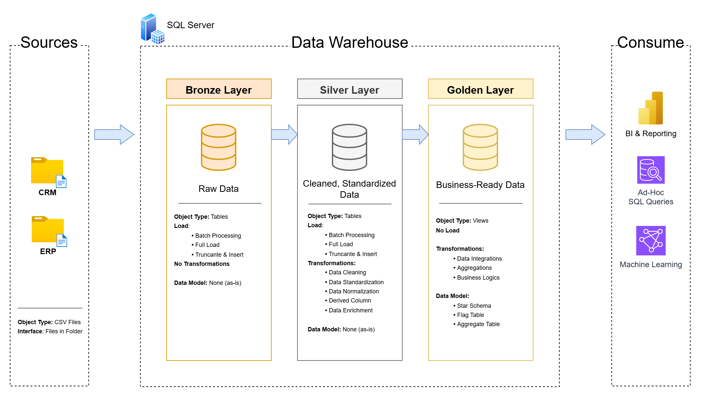
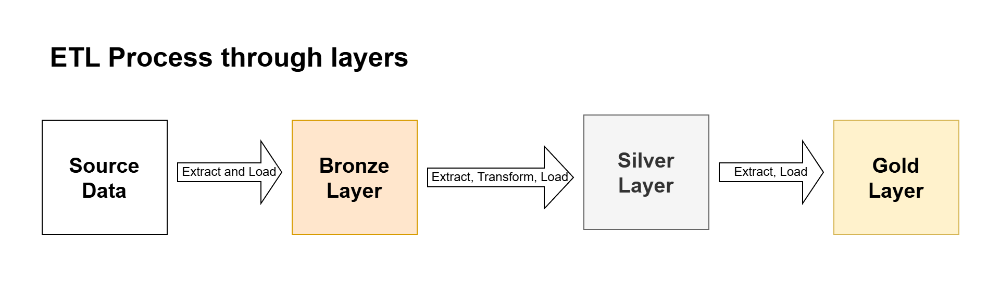
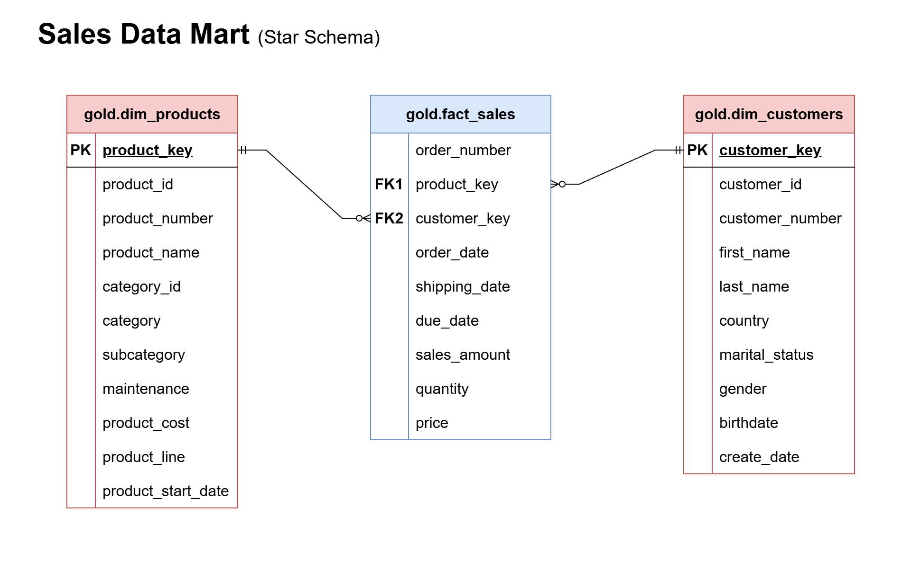

# Data Warehouse and Analytics Project

This project demonstrates a comprehensive data warehousing and analytics solution, from building a data warehouse to generating actionable insights. Designed as a portifolio project, it highlights industry best practices in data engineering and analytics.

## 📑 Table of Contents

- [Project Overview](#project-overview)
- [Project Requirements](#-project-requirements)
- [Data Sources](#-data-sources)
- [Project Architecture](#project-architecture)
- [ETL Process](#etl-process)
- [Data Model](#-data-model)
- [Repository Structure](#repository-structure)
- [How to Run](#-how-to-run)
- [License](#license)
- [About Me](#-about-me)

-----------------------

## Project Overview

This project demonstrates the end-to-end development of a modern SQL Data Warehouse following industry-standard data engineering practices. The goal is to transform raw data from multiple source systems into a structured, analytics-ready environment that supports business intelligence, reporting, and decision-making.

The solution is built using the **Medallion Architecture**, which organizes data into progressive layers of refinement, ensuring data quality, maintainability, and scalability.


-----------------------

## 🚀 Project Requirements

### Building the Data Warehouse (Data Engineering)

#### Objective
Develop a modern data warehouse using SQL Server to consolidate sales data, enabling analytical reporting and informed decision-making.

#### Specifications
- **Data Sources**: Import data from two source systems (ERP and CRM) provided as CSV files.
- **Data Quality**: Cleanse and resolve data quality issues prior to analysis.
- **Integration**: Combine both sources into a single, user-friendly data model designed for analytical queries.
- **Scope**: Focus on the latest dataset only; historization of data is not required.
- **Documentation**: Provide clear documentation of the data model to support both business stakeholders and analytics teams.

---

### BI: Analytics & Reporting (Data Analysis)

#### Objective
Develop SQL-based analytics to deliver detailed insights into:
- **Customer Behavior**
- **Product Performance**
- **Sales Trends**

These insights empower stakeholders with key business metrics, enabling strategic decision-making.  

-----------------------

## Project Architecture

The data architecture of this project follows the Medallion Architecture **Bronze, Silver and Gold** layers:



1. **Bronze Layer**: Stores raw data ingested from source systems with minimal modifications.
2. **Silver Layer**: Cleanses, standardizes, and transforms raw data into a consistent and reliable format.
3. **Gold Layer**: Provides business-ready data models optimized for reporting, analytics, and decision-making.
-----------------------

## 💽 Data Sources

This project integrates data from two business systems:

1. **CRM (Customer Relationship Management):**
   Contains customer-related information, including customer details, such as country.

2. **ERP (Enterprise Resource Planning):**
   Contains operational and business data such as products, orders, and financial transactions.

These datasets are combined and transformed within the data warehouse to provide a unified view for reporting and analytics.

## ETL Process

During the process the data goes through different processes in order to be prepared before going to the next layer. Here it is an overview about these processes between different layers



| Layer Phase      | Process Involved | Description |
|------------------|------------------|-------------|
| Source -> Bronze | Extract and Load | Data is extracted from source systems and loaded as-is. |
| Bronze -> Silver | Extract, Transform and Load | Data is extracted from the Bronze layer. It is cleansed, standardized, and transformed to improve data quality, and then loaded into the Silver layer. |
| Silver -> Gold | Extract and Load | Data is extracted from the Silver layer. Modeled into fact and dimension tables following a star schema. |


-----------------------

## ⭐ Data Model

The Gold layer is designed using a **Star Schema** to support analytics and reporting.

The model consists of:
- **Fact Table (`gold.fact_sales`):** store information about transactions business measures.
- **Dimension Tables (`gold.dim_customers`, `gold.dim_products`):** store descriptive information that provide context for sales analysis. 

This design improves query performance, reporting speed, and makes analysis across customers more efficient.



## Technologies Used

- Microsoft SQL Server
- T-SQL
- Git
- GitHub
- Draw.io
- Visual Studio Code

## Repository Structure

```text
sql-data-warehouse-project/
│
├── archive/                     # Archived files and previous project versions
├── datasets/                    # Source datasets used in the ETL process
│
├── docs/                        # Project documentation
│   ├── data_architecture/       # Data warehouse architecture diagrams and notes
│   ├── data_flow/               # Data flow documentation
│   ├── etl_process/             # ETL processes documentation
│   ├── integration_model/       # Source-to-target integration models
│   ├── star_schema/             # Star schema designs and documentation
│   ├── data_catalog.md          # Data dictionary and metadata documentation
│   └── naming_conventions.md    # Naming standards used throughout the project
│
├── scripts/                     # SQL scripts organized by warehouse layers
│   ├── analytics/               # SQL Queries for reporting and business questions
│   │   └── reports/             # SQL analytical views about products and customers
│   ├── bronze/                  # Raw data ingestion and loading scripts
│   ├── silver/                  # Data cleansing and transformation scripts
│   ├── gold/                    # Business-ready data models and aggregations
│   └── init_database.sql        # Database initialization script
│
├── tests/                       # Data validation and testing scripts
│
├── .gitignore                   # Git ignored files and folders
├── LICENSE                      # Project license
└── README.md                    # Project overview and documentation
```


-----------------------
## License

This project is licensed under the [MIT License](LICENSE). You are free to use, modify, and share this project with proper attribution.

-----------------------
## 👨‍💻 About Me

Hi! i'm Rodrigo, a data engineer student that is learning new things every day.